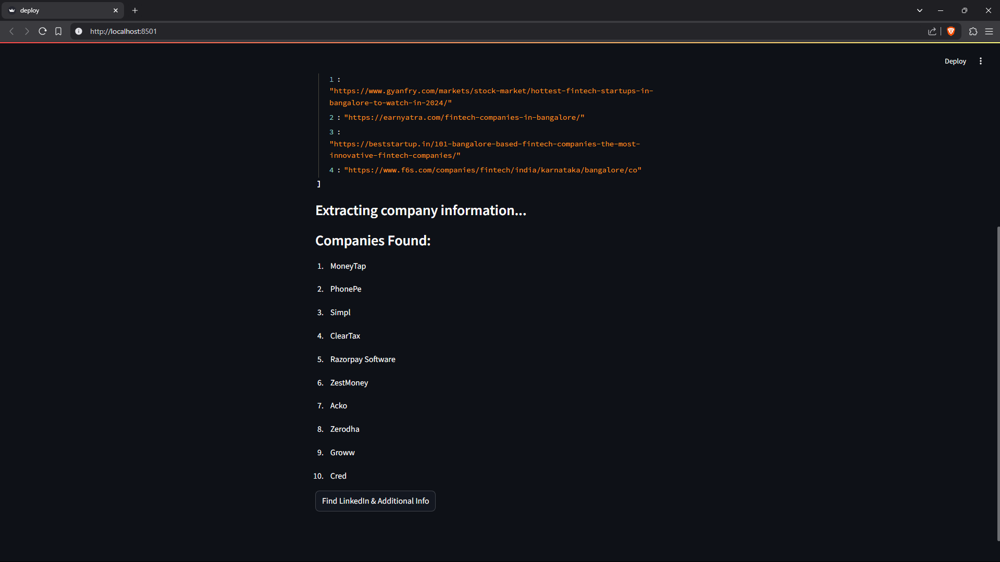

# Company Information Scraper

## Description
This project is a web scraping tool that finds information about companies. It uses DuckDuckGo search, extracts data from web pages, and leverages LinkedIn to gather additional details about companies. Its my pre-internship handbook submission for Caprae Capital Partners.

## Features
- Enhances search queries using AI (OpenAI API)
- Scrapes web pages for relevant company information
- Finds LinkedIn pages for companies
- Extracts company details from LinkedIn

## Requirements
- Python 3.x
- Required libraries: requests, beautifulsoup4, openai, streamlit

## Video Demo
https://www.youtube.com/watch?v=lqdlku6L1dE

## Results

